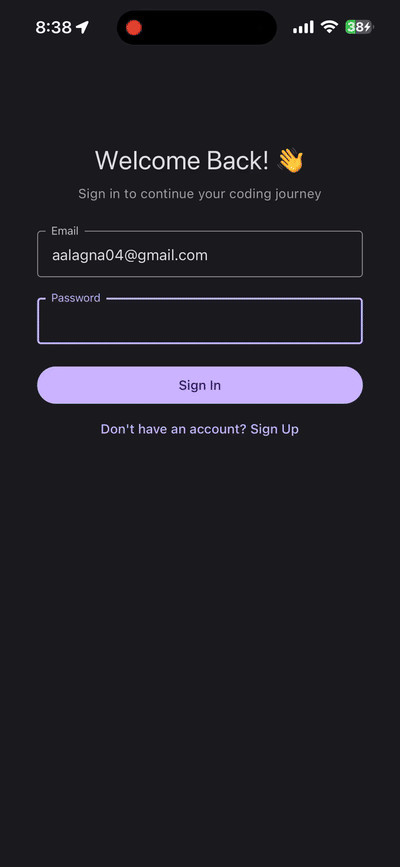
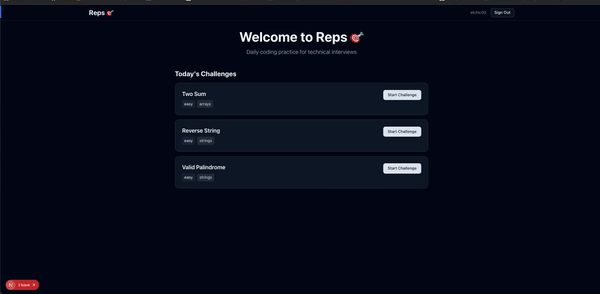

<div align="center">
  <h1>🎯 Reps</h1>
  <p><strong>Daily coding practice for technical interviews</strong></p>
  <p>Build your reps, one challenge at a time.</p>

  [](https://www.typescriptlang.org/)
  [](https://reactjs.org/)
  [](https://nextjs.org/)
  [](https://reactnative.dev/)
  [](https://expo.dev/)
  [](https://supabase.com/)
</div>

---

## 📱 Demo

<div align="center">
  <table>
    <tr>
      <td align="center"><strong>📱 Mobile App</strong></td>
      <td align="center"><strong>🌐 Web App</strong></td>
    </tr>
    <tr>
      <td>
        
      </td>
      <td>
        
      </td>
    </tr>
  </table>
</div>

---

## ✨ Features

- 🎯 **Daily Coding Challenges** - Fresh LeetCode-style problems every day
- 💻 **Live Code Editor** - Monaco editor with syntax highlighting and auto-completion
- ⚡ **Real-time Execution** - Test your code instantly with Judge0 API integration
- 📱 **Cross-Platform Sync** - Seamless experience across mobile and web
- 🔥 **Streak Tracking** - Build consistency with daily streak counters
- 🏆 **Leaderboards** - Compete with friends and track your progress
- 📊 **Progress Analytics** - Visualize your improvement over time
- 🌙 **Dark Mode** - Easy on the eyes during late-night coding sessions
- 🔐 **Secure Auth** - Built on Supabase for robust authentication

## 🏗️ Architecture

This is a **monorepo** with shared code between mobile and web platforms:

```
reps/
├── mobile/          # React Native (Expo) - iOS & Android apps
├── web/             # Next.js - Web application
├── shared/          # Shared TypeScript types and utilities
└── node_modules/    # Shared dependencies
```

## 🚀 Tech Stack

### 📱 Mobile (React Native + Expo)
- **Framework:** React Native 0.81 + Expo 54
- **Navigation:** Expo Router 6.0 (file-based routing)
- **UI Library:** React Native Paper
- **State Management:** Zustand
- **Backend:** Supabase (Auth, Database, Real-time)
- **Language:** TypeScript

### 🌐 Web (Next.js)
- **Framework:** Next.js 15.5 (App Router + Turbopack)
- **Styling:** Tailwind CSS 4
- **UI Components:** Radix UI + Custom components
- **Code Editor:** Monaco Editor
- **Backend:** Supabase
- **API Integration:** Judge0 for code execution
- **Language:** TypeScript

### 🔗 Shared
- Common TypeScript types and interfaces
- Utility functions
- Constants and configurations

## 📦 Quick Start

### Prerequisites

- **Node.js** 18 or higher
- **npm** or **yarn**
- **Expo CLI** (for mobile development)
- **Git**

### Installation

1. **Clone the repository**
   ```bash
   git clone https://github.com/yourusername/reps.git
   cd reps
   ```

2. **Install dependencies**
   ```bash
   npm install
   ```

3. **Set up environment variables**

   Create `.env.local` files in both `mobile/` and `web/` directories:

   **mobile/.env.local**
   ```bash
   EXPO_PUBLIC_SUPABASE_URL=your_supabase_url
   EXPO_PUBLIC_SUPABASE_ANON_KEY=your_supabase_anon_key
   ```

   **web/.env.local**
   ```bash
   NEXT_PUBLIC_SUPABASE_URL=your_supabase_url
   NEXT_PUBLIC_SUPABASE_ANON_KEY=your_supabase_anon_key
   JUDGE0_API_KEY=your_judge0_api_key
   ```

### Running the Apps

#### 🌐 Web Application

```bash
cd web
npm run dev
```

Visit [http://localhost:3000](http://localhost:3000)

#### 📱 Mobile Application

```bash
cd mobile
npm start
```

Then:
- Press `i` for iOS simulator
- Press `a` for Android emulator
- Scan QR code with Expo Go app for physical device

## 🛠️ Development

### Project Structure

```
mobile/
├── app/                 # Expo Router screens
│   ├── (auth)/         # Authentication screens
│   └── (tabs)/         # Main app tabs
├── components/         # Reusable components
└── lib/               # Utilities and configurations

web/
├── app/               # Next.js app directory
│   ├── challenge/     # Challenge pages
│   └── login/         # Auth pages
├── components/        # React components
│   ├── ui/           # UI primitives
│   └── navigation/   # Navigation components
└── lib/              # Utilities and Supabase client

shared/
├── types/            # Shared TypeScript types
└── utils/            # Shared utility functions
```

### Available Scripts

```bash
# Root level
npm install              # Install all dependencies
npm run web             # Start web dev server
npm run mobile          # Start mobile dev server

# Web (cd web/)
npm run dev             # Start Next.js dev server
npm run build           # Build for production
npm run start           # Start production server
npm run lint            # Run ESLint

# Mobile (cd mobile/)
npm start               # Start Expo dev server
npm run ios             # Run on iOS simulator
npm run android         # Run on Android emulator
npm run web             # Run on web browser
```

## 🗄️ Database Schema

Built with Supabase PostgreSQL:

- **users** - User profiles and metadata
- **challenges** - Coding challenges with test cases
- **submissions** - User code submissions and results
- **streaks** - Daily streak tracking
- **leaderboards** - Friend rankings and scores

## 🔐 Authentication

Cross-platform authentication powered by Supabase:
- Email/Password authentication
- OAuth providers (GitHub, Google)
- Secure session management
- Deep linking for mobile-to-web auth flow

## 🚧 Roadmap


- [ ] Connect to CodePath interview prep with cohort leaderboards 
- [ ] Interview prep mode with timer
- [ ] AI-powered hints and explanations
- [ ] Achievement badges and rewards
- [ ] Code review from mentors
- [ ] Company-specific question sets (FAANG)
- [ ] Video solution walkthroughs
- [ ] Collaborative coding sessions (Stretch)
- [ ] Weekly coding contests (Stretch)

## 🤝 Contributing

Contributions are welcome! Here's how you can help:

1. **Fork** the repository
2. **Create** a feature branch (`git checkout -b feature/amazing-feature`)
3. **Commit** your changes (`git commit -m 'Add some amazing feature'`)
4. **Push** to the branch (`git push origin feature/amazing-feature`)
5. **Open** a Pull Request

Please read [CONTRIBUTING.md](CONTRIBUTING.md) for details on our code of conduct and development process.

## 📝 License

This project is licensed under the MIT License - see the [LICENSE](LICENSE) file for details.

## 🙏 Acknowledgments

- [Supabase](https://supabase.com/) - Backend infrastructure and authentication
- [Judge0](https://judge0.com/) - Code execution engine
- [Monaco Editor](https://microsoft.github.io/monaco-editor/) - Code editor
- [Expo](https://expo.dev/) - React Native framework
- [Next.js](https://nextjs.org/) - Web framework
- [Tailwind CSS](https://tailwindcss.com/) - Styling framework

## 📧 Contact

Built with ❤️ by [Your Name](https://github.com/yourusername)

- Website: [yourwebsite.com](https://yourwebsite.com)
- Email: your.email@example.com
- Twitter: [@yourhandle](https://twitter.com/yourhandle)

---

<div align="center">
  <p>⭐ Star this repo if you find it helpful!</p>
  <p>Made with TypeScript, React, and lots of coffee ☕</p>
</div>
